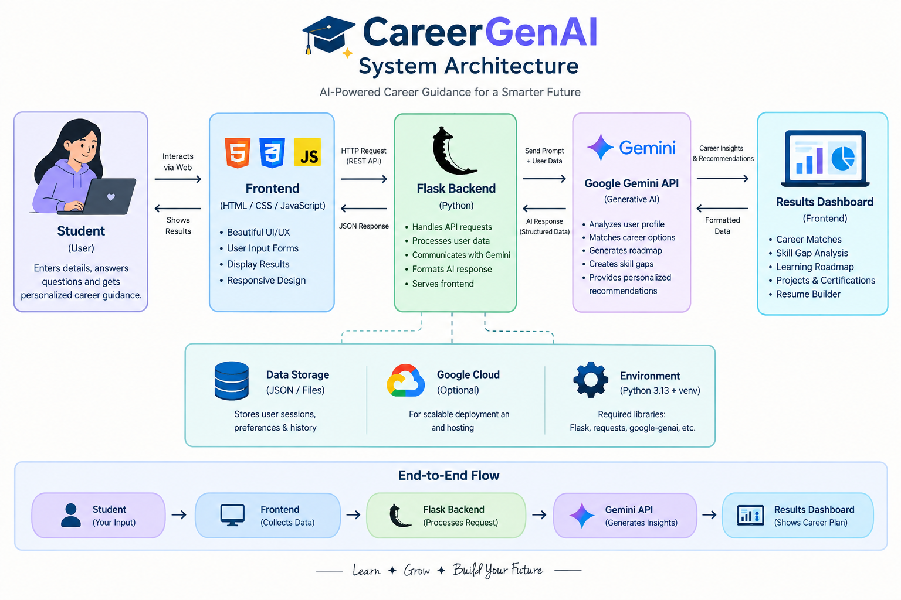
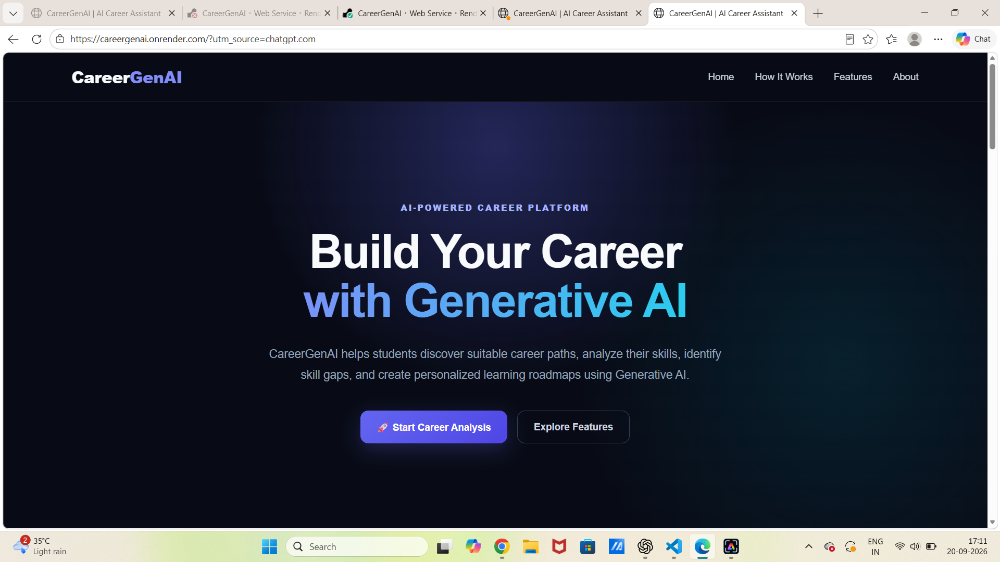
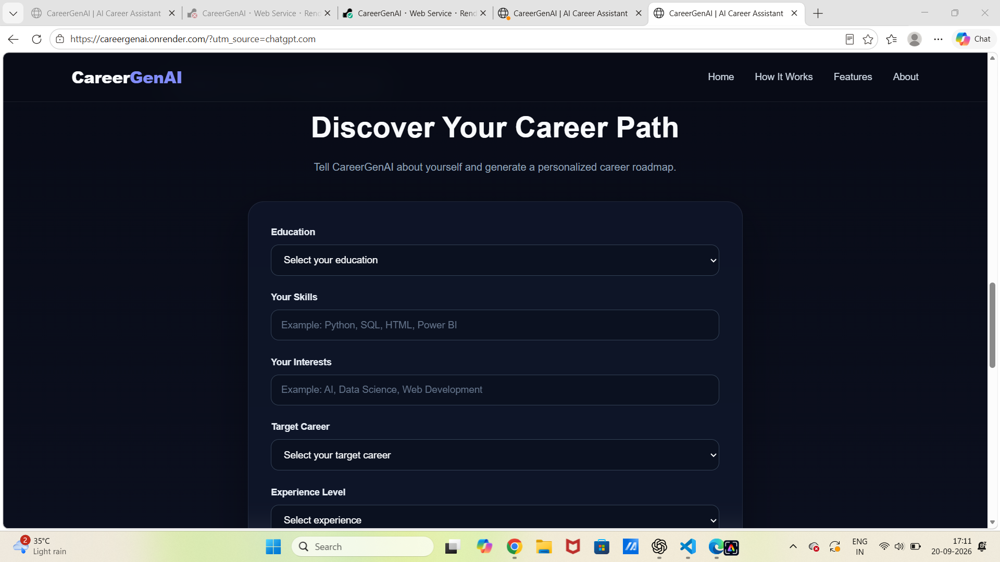
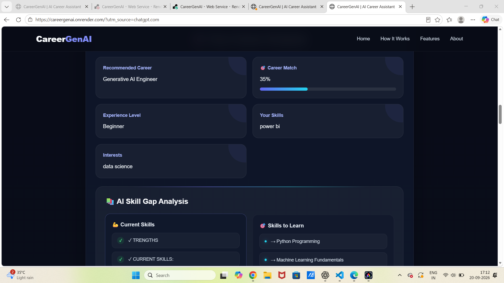
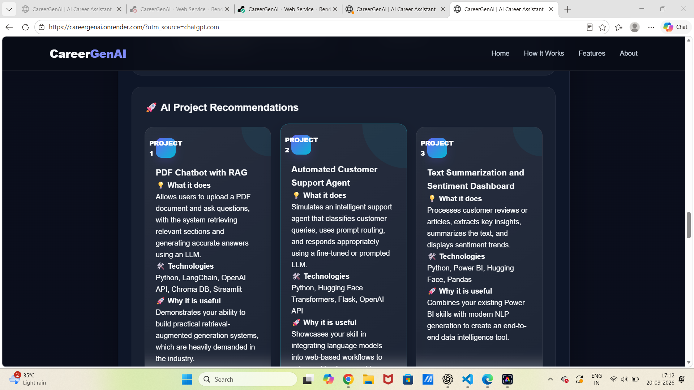

# 🚀 CareerGenAI — AI Career Assistant

CareerGenAI is a **Generative AI-powered career guidance platform** designed to help students understand their current skills, explore career paths, identify skill gaps, build personalized learning roadmaps, discover practical projects, and improve their resumes.

The platform analyzes a student's:

* 🎓 Education
* 💻 Technical skills
* ❤️ Interests
* 🎯 Target career
* 📈 Experience level

and generates personalized AI-powered career guidance.

---

## ✨ Features

### 🎯 Career Recommendation

Analyzes the student's profile and provides a career direction based on their education, skills, interests, experience, and career goal.

### 📊 Career Match Score

Generates a percentage-based career match score to show how closely the student's current profile aligns with the recommended career.

### 💪 Skill Gap Analysis

Identifies:

* Current technical skills
* Important missing skills
* Skills to learn next

### 🗺️ Personalized Learning Roadmap

Creates a structured learning roadmap with practical steps, skills to practice, and expected outcomes.

### 🚀 AI Project Recommendations

Suggests practical projects relevant to the student's target career to help build a stronger portfolio.

### 📄 Resume Improvements

Provides AI-generated recommendations for improving the student's resume and highlighting relevant technical skills, projects, and experience.

### 📊 Career Readiness Dashboard

Displays multiple career-readiness indicators:

* 🎯 Career Match
* 💻 Technical Skills
* 🧠 AI Readiness
* 📈 Overall Readiness

### 📥 Career Report

Allows users to print or save their personalized CareerGenAI analysis as a PDF report.

---
## 🏗️ System Architecture



---
## 🧠 How It Works## 📸 Screenshots


### 🏠 Home Page



### 📝 Career Analysis



### 🎯 AI Career Results



### 📊 Career Dashboard



---

```text
Student Profile
       ↓
CareerGenAI Frontend
       ↓
Flask Backend
       ↓
Google Gemini API
       ↓
AI Career Analysis
       ↓
Career Recommendation
       ↓
Skill Gap Analysis
       ↓
Learning Roadmap
       ↓
Project Recommendations
       ↓
Resume Improvements
       ↓
Career Readiness Dashboard
       ↓
Career Report
```

---

## 🛠️ Tech Stack

### Frontend

* HTML5
* CSS3
* JavaScript

### Backend

* Python
* Flask
* Flask-CORS
* python-dotenv

### Generative AI

* Google Gemini API
* `google-genai` Python SDK

### Development Tools

* Visual Studio Code
* Git
* GitHub
* ngrok

---

## 📁 Project Structure

```text
CareerGenAI/
│
├── backend/
│   └── app.py
│
├── frontend/
│   ├── index.html
│   ├── style.css
│   └── script.js
│
├── .gitignore
├── README.md
└── requirements.txt
```

---

## ⚙️ Installation

### 1. Clone the repository

```bash
git clone https://github.com/nethraselvan96-pixel/CareerGenAI.git
```

### 2. Open the project

```bash
cd CareerGenAI
```

### 3. Create a virtual environment

Windows:

```powershell
py -m venv .venv
```

### 4. Activate the virtual environment

```powershell
.\.venv\Scripts\Activate.ps1
```

### 5. Install dependencies

```powershell
pip install -r requirements.txt
```

---

## 🔑 Gemini API Setup

Create a `.env` file in the project root:

```text
GEMINI_API_KEY=your_api_key_here
```

Replace `your_api_key_here` with your Gemini API key.

⚠️ **Never upload your API key to GitHub.**

The `.env` file should remain ignored by Git.

---

## ▶️ Run the Application

From the project directory:

```powershell
python backend\app.py
```

The application will run locally at:

```text
http://127.0.0.1:5000
```

Open that address in your browser.

---

## 📱 Mobile Testing

The application can also be tested on a mobile device by exposing the local Flask server through a tunneling service such as ngrok.

Example:

```powershell
ngrok http 5000
```

Then open the generated HTTPS address on your phone.

---

## 🎯 Example User Flow

```text
Enter Profile
      ↓
Select Target Career
      ↓
Analyze Career
      ↓
View Career Match
      ↓
Review Current Skills
      ↓
Identify Skill Gaps
      ↓
Follow Learning Roadmap
      ↓
Build Recommended Projects
      ↓
Improve Resume
      ↓
Download Career Report
```

---

## 🔮 Future Improvements

Planned improvements include:

* 🔐 User authentication
* 💾 User profile storage
* 📄 Resume upload and analysis
* 🧠 Retrieval-Augmented Generation (RAG)
* 📚 Course recommendations
* 🔗 LinkedIn profile integration
* 📈 Progress tracking
* 🏆 Skill achievement tracking
* 🤖 AI career chatbot
* ☁️ Cloud deployment
* 📊 Advanced career analytics

---

## 🎓 Project Purpose

CareerGenAI was developed as a practical **Generative AI project** to explore how AI can be used to provide personalized career guidance for students.

The project combines:

**AI + Web Development + Career Analytics + Personalized Learning**

---

## 👩‍💻 Author

**Nethra Selvan**

B.Tech — Artificial Intelligence & Data Science

Interested in:

* Generative AI
* Artificial Intelligence
* Machine Learning
* Data Science
* AI Engineering

---

## ⭐ Project Highlights

CareerGenAI demonstrates practical implementation of:

* Generative AI integration
* API-based AI applications
* Prompt engineering
* Flask backend development
* Frontend development
* Dynamic JavaScript UI
* Skill-gap analysis
* Personalized recommendations
* AI-generated learning roadmaps
* Career-readiness visualization
* PDF career reporting

---

⭐ If you find this project useful, consider giving the repository a star.
